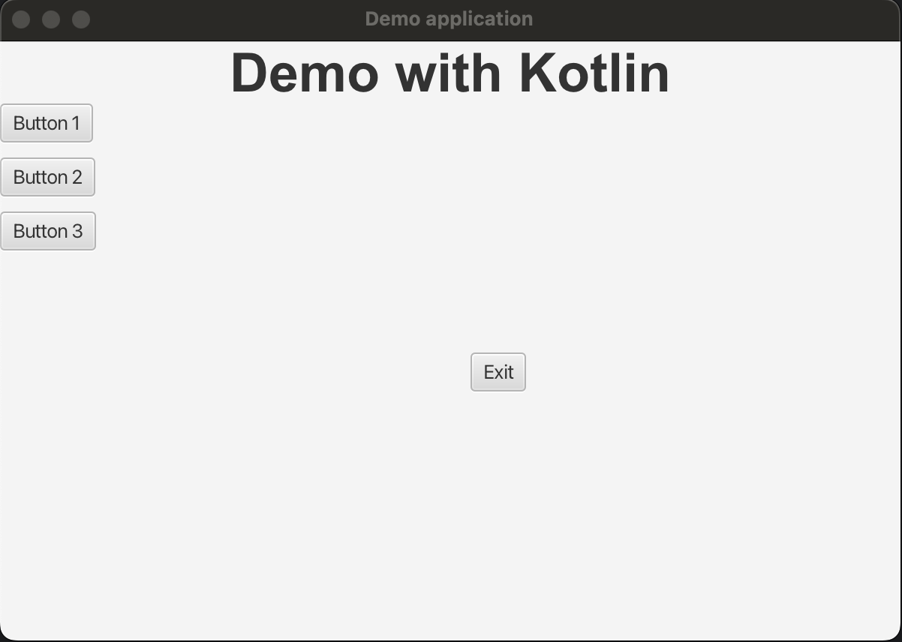

# Example project JavaFX code in Java versus Kotlin

Shows the same basic user interface with a BorderPane, Buttons, etc. to be able to compare the code structure in Java versus Kotlin. You can also use this project as a template for your JavaFX+Kotlin project as it also includes a GitHub Action workflow.

## Executing the application

* Modify `build.gradle.kts`, change the `application` setting:
  * For Java: `mainClass.set("be.webtechie.MainJava")`
  * For Kotlin: `mainClass.set("be.webtechie.MainKotlin")`
* Run it with the button shown in IntelliJ IDEA
* Or in the terminal: `./gradlew run`